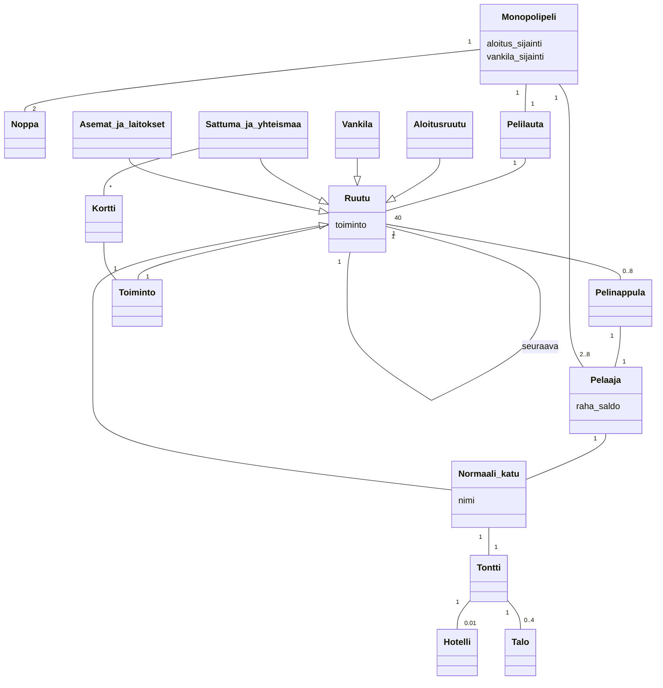

## Monopoli,luokkakaavio

```mermaid
 classDiagram
    Monopolipeli "1" -- "2" Noppa
    Monopolipeli "1" -- "1" Pelilauta
    Pelilauta "1" -- "40" Ruutu
    Ruutu "1" -- "1" Ruutu : seuraava
    Ruutu "1" -- "0..8" Pelinappula
    Pelinappula "1" -- "1" Pelaaja
    Pelaaja "2..8" -- "1" Monopolipeli
    Aloitusruutu --|> Ruutu
    Vankila --|> Ruutu
    Sattuma_ja_yhteismaa --|> Ruutu
    Sattuma_ja_yhteismaa -- "*" Kortti
    Asemat_ja_laitokset --|> Ruutu
    Normaali_katu --|> Ruutu
    Normaali_katu "1" -- "1" Tontti
    Tontti "1" -- "0.01" Hotelli
    Tontti "1" -- "0..4" Talo

    Ruutu -- "1" Toiminto
    Kortti -- "1" Toiminto

    Pelaaja "1" --  Normaali_katu
    class Normaali_katu {
      nimi
    }
    class Monopolipeli {
      aloitus_sijainti
      vankila_sijainti
    }
    class Ruutu {
      toiminto
    }
    class Pelaaja {
      raha_saldo
    }  


    
```
