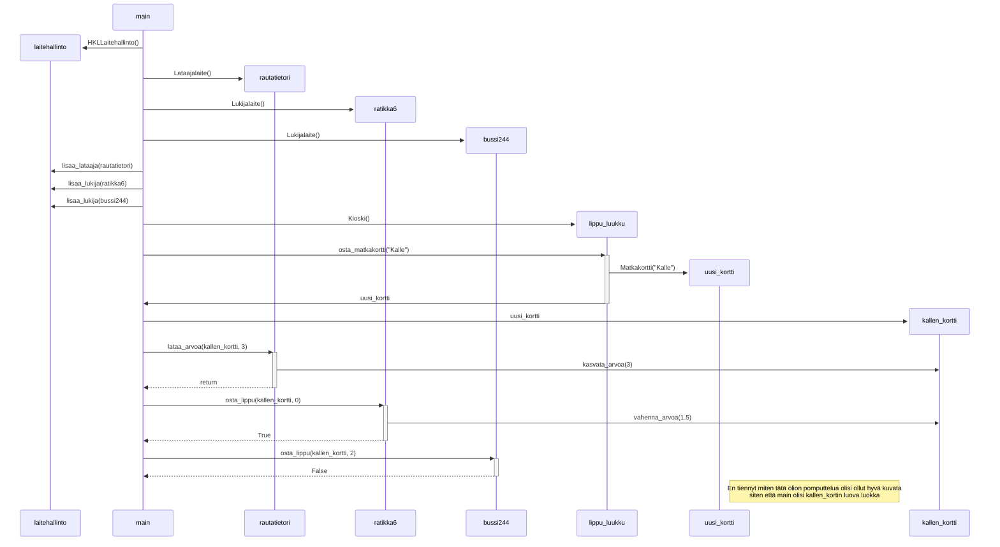

```mermaid
sequenceDiagram
    create participant laitehallinto
    main->>laitehallinto: HKLLaitehallinto()
    create participant rautatietori
    main->>rautatietori: Lataajalaite()
    create participant ratikka6
    main->>ratikka6: Lukijalaite()
    create participant bussi244
    main->>bussi244: Lukijalaite()
    main->>laitehallinto:lisaa_lataaja(rautatietori)
    main->>laitehallinto:lisaa_lukija(ratikka6)
    main->>laitehallinto:lisaa_lukija(bussi244)
    create participant lippu_luukku
    main->>lippu_luukku: Kioski()
    main->>+lippu_luukku: osta_matkakortti("Kalle")
    create participant uusi_kortti
    lippu_luukku->>uusi_kortti: Matkakortti("Kalle")
    lippu_luukku->>-main: uusi_kortti
    create participant kallen_kortti
    main->>kallen_kortti: uusi_kortti
    main->>+rautatietori: lataa_arvoa(kallen_kortti, 3)
    rautatietori->>kallen_kortti: kasvata_arvoa(3)
    rautatietori-->>-main: return
    main->>+ratikka6: osta_lippu(kallen_kortti, 0)
    ratikka6->> kallen_kortti: vahenna_arvoa(1.5)
    ratikka6-->>-main: True
    main->>+bussi244:osta_lippu(kallen_kortti, 2)
    bussi244-->>-main: False
    Note right of uusi_kortti : En tiennyt miten tätä olion pomputtelua olisi ollut hyvä kuvata <br/> siten että main olisi kallen_kortin luova luokka
```
