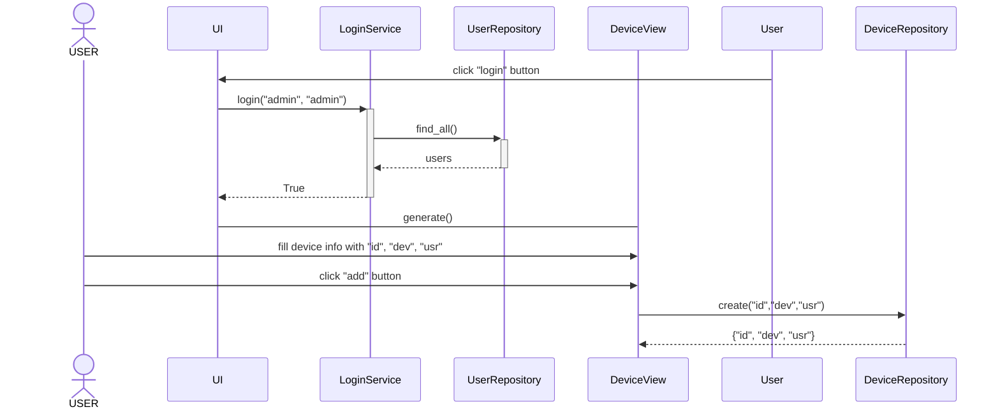

# Ohjelman rakenne
Ohjelma koostii kolmesta kerroksesta. Käyttöliitymästä, Service/palvelu tasosta ja repositoryistä
Käyttöliittymä toteuttaa käyttäjälle näkyvän toiminnallisuuden. Käyttöliittymä esittää ja hallitsee repositoryjen tietoja joko suoraan tai palvelun kautta.
Yksinkertaisimmat interaktiot käyttöliittymän ja repositoryjen välillä on toteutettu suoraan käyttöliittymäkoodissa, mutta monimutkaisemmat esimerkiksi
käyttäjän sisäänkirjautumisen varmistaminen on oma palvelutasoinen luokka jonka kautta käyttöliittymällä on yhteys repositorioon.
Vastaavasti repositorioiden kannalta yksinkertainen toiminnallisuus on totetettu repositorio luokissa. Esimerkiksi yksinkertaiset lisäys ja poisto ominaisuudet.
Ohjelman äärimmäisenä ulottuvuutena on repositorioiden kommunikaatio tietokannan kanssa. Kommunikaatio tietokantojen kanssa on toteutettu repositorio luokkien osana.

# Ohjelman toiminta
Ohjelman käyttöliittymä käynnistetään siten että sille annetaan riippuvuudeksi laiterepositorio. Käyttöliittymä voi laiterepositorio luokkaa
käyttäen hakea, lisätä ja poistaa laitteita.
Järjestelmään kirjautuminen tapahtuu käyttöliittymässä kirjautumispalvelun kautta. Käyttöliittymä antaa syötetyt tunukset kirjautumispalvelulle.
Kirjautumispalvelu saa käyttäjä repositorion jonka avulla se voi tarkistaa käyttöliittymän sille antamien tunnusten oikeellisuuden. 

## Sekvenssikaavio käyttäjän kirjautumisesta ja uuden laitteen lisäämisestä
Esimerkki ohjelmaluokkien välisestä toiminnallisuudesta.

