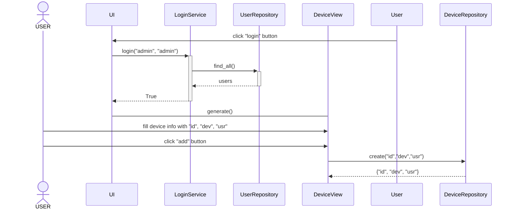

## Sekvenssikaavio käyttäjän kirjautumisesta ja uuden laitteen lisäämisestä

```mermaid
sequenceDiagram
  actor USER
  participant UI
  participant LoginService
  participant UserRepository
  participant DeviceView
  User ->> UI: click "login" button
  UI ->>+ LoginService: login("admin", "admin")
  LoginService ->>+ UserRepository: find_all()
  UserRepository -->>- LoginService: users
  LoginService -->>- UI: True
  UI -> DeviceView: generate()
  USER  ->> DeviceView: fill device info with "id", "dev", "usr"
  USER ->> DeviceView: click "add" button
  DeviceView ->> DeviceRepository: create("id","dev","usr")
  DeviceRepository -->> DeviceView: {"id", "dev", "usr"} 
```

